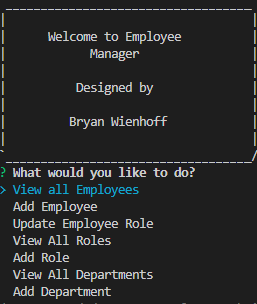

# Employee-Tracker
This is an app that uses the CLI to quickly and easily create a employee list stored on a database. 

## Table of Contents
- [Installation](#Installation)
- [Usage](#Usage)
- [Contributing](#Contributing)
- [Technologies](#Technologies)
- [Questions](#Questions)
- [Acknowledgments](#Acknowledgments)

## Installation
In order to run this program you will need a code editor, either VS code or something similar. Once opening the server.js file, install all dependencies. From there open the schema.sql file using mysql2 or something similar. After the database is initialized use 'npm start' from the root file.  

## Usage 
Once the app starts, user will see this prompt with the following options:

User can view all departments, roles and employees on a formatted table in the CLI. User may also choose to add one of the three above listed items. Those added items will then be updated to the database and will be shown when the 'view' option is selected again. User also has the option to update the role of an individual employee, which will be changed within the database. To find the total salary or a selected department, use the 'Department Total Salary Option' and then select the desired department. A full video showing functionality is provided below. 

https://user-images.githubusercontent.com/106857564/189443653-1fcdd39c-a832-4ce2-a7e8-9a52d233e689.mp4

Link to video on Google Drive 

[https://drive.google.com/file/d/1I-je0Lj8GfqXh9IfCiuk6DcIDmiXTk1e/view](https://watch.screencastify.com/v/rwky0tp8dVWcZV4EcZyL)

## Contributing 
Here are the steps in order to contribute to this project.
1. **Fork** the repo on GitHub
2. **Clone** the project to your own machine
3. **Commit** changes to your own branch
4. **Push** your work back up to your fork
5. Submit a **Pull Request** so that we can review your changes

NOTE: Be sure to merge the latest from `main` before making a pull request!

## Technologies
- JavaScript
- Node.JS(using Express, Inquirer, console.table 3rd party modules)
- SQL database through mysql-promise node package module 

## Questions
Please refer any questions or problem issues to bhoff1980@gmail.com.

## Acknowledgments
Andres Jimenez (Tudor)  
Kirtley Adams (Teaching Assistant)  
Dan Kaltenbaugh (Instructor) 
George Yoo (Teaching Assisstant)

